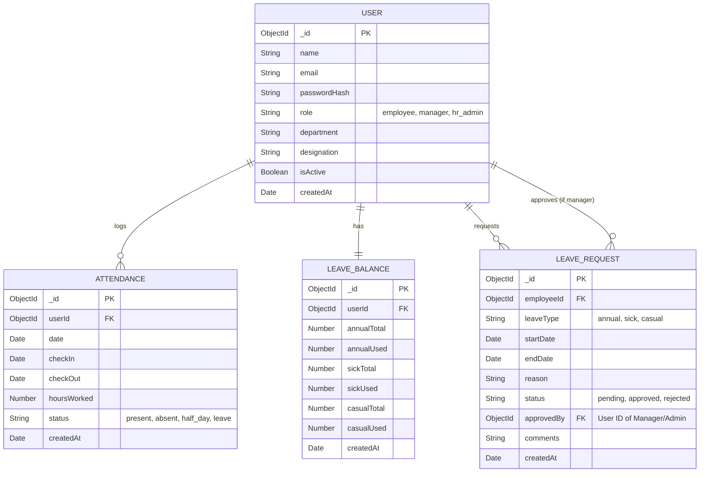

# Entity Relationship Diagram (ERD)

This diagram visualizes the MongoDB database schema for the Employee Onboarding Portal.

```mermaid
erDiagram
    USER {
        ObjectId _id PK
        String name
        String email
        String passwordHash
        String role "employee, manager, hr_admin"
        String department
        String designation
        Boolean isActive
        Date createdAt
    }
    
    ATTENDANCE {
        ObjectId _id PK
        ObjectId userId FK
        Date date
        Date checkIn
        Date checkOut
        Number hoursWorked
        String status "present, absent, half_day, leave"
        Date createdAt
    }

    LEAVE_BALANCE {
        ObjectId _id PK
        ObjectId userId FK
        Number annualTotal
        Number annualUsed
        Number sickTotal
        Number sickUsed
        Number casualTotal
        Number casualUsed
        Date createdAt
    }

    LEAVE_REQUEST {
        ObjectId _id PK
        ObjectId employeeId FK
        String leaveType "annual, sick, casual"
        Date startDate
        Date endDate
        String reason
        String status "pending, approved, rejected"
        ObjectId approvedBy FK "User ID of Manager/Admin"
        String comments
        Date createdAt
    }

    USER ||--o{ ATTENDANCE : "logs"
    USER ||--|| LEAVE_BALANCE : "has"
    USER ||--o{ LEAVE_REQUEST : "requests"
    USER ||--o{ LEAVE_REQUEST : "approves (if manager)"
```
